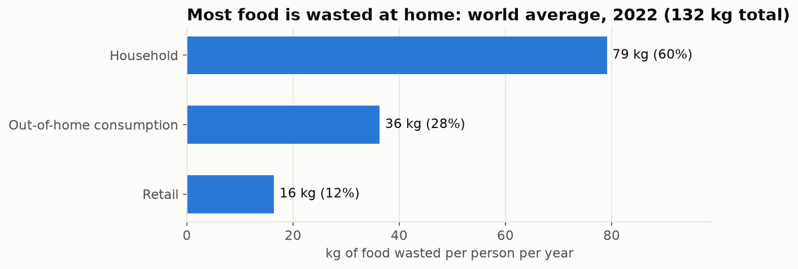
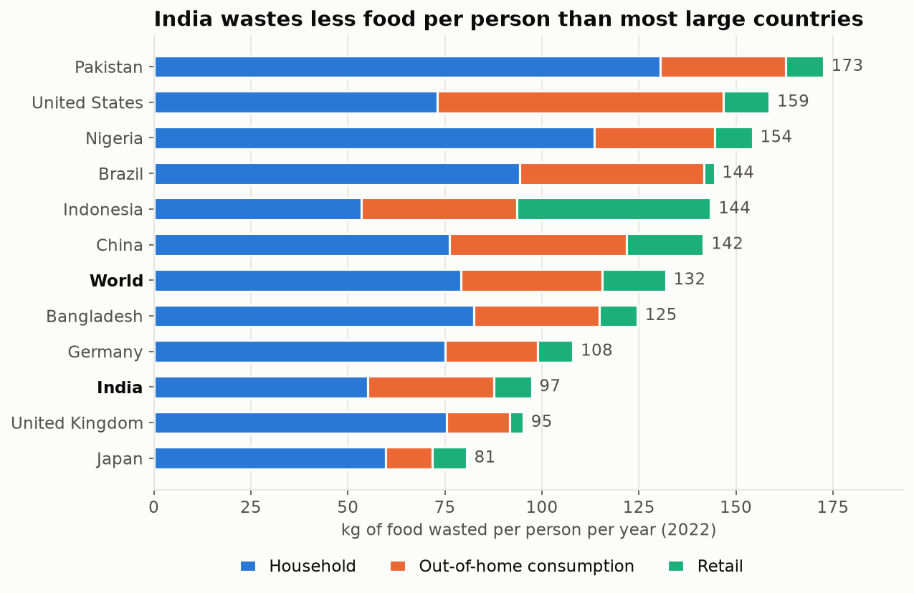
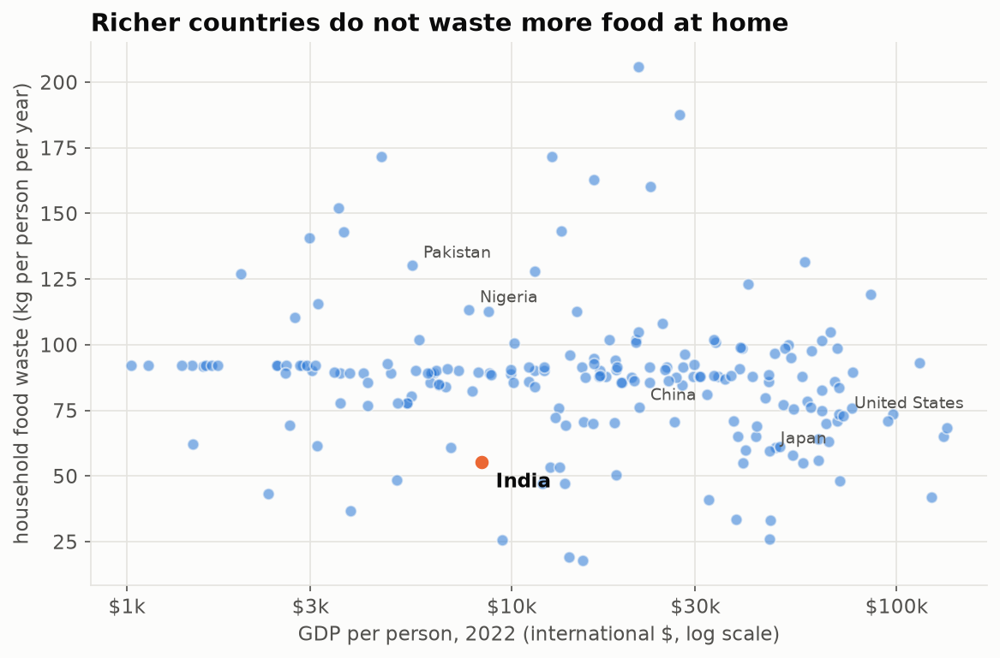
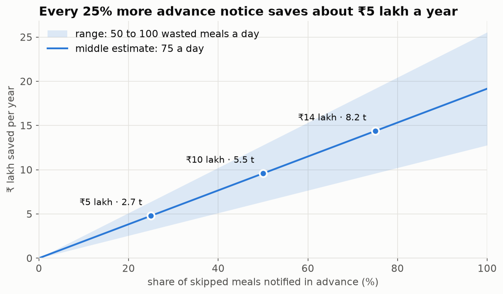

# Where does the world waste its food?

A short Python analysis of the **UN Food Waste Index** (2022): how much food each person wastes
per year, where in the food chain it happens, how India compares, and whether richer countries
waste more.

I built this alongside **Mess Saver**, an app that helps IIM Bangalore students give the hostel
mess advance notice of meals they will miss, so less food is cooked and wasted.

## Key findings

**1. Most food is wasted at home.** Of the 132 kg wasted per person per year worldwide, 60% is
thrown away in households, 28% in restaurants, canteens and messes, and 12% in shops.



**2. India wastes less than most large countries.** About 97 kg per person per year, against a world
average of 132 kg. India's household waste (55 kg) ranks 209th of 228 countries.



**3. There is no reliable link between wealth and household waste.** GDP per person explains only
about 3% of the differences between countries. The slight negative correlation (−0.23, bootstrap 95% CI
−0.36 to −0.09) disappears once continent is controlled for (p = 0.83) and weakens when likely-estimated
values are removed. Food waste at home is a habit-and-planning problem everywhere.



**4. A single hostel mess matters.** On rough estimates (50–100 meals a day cooked for students who
don't turn up, 0.4 kg and ₹70 per meal), the IIM Bangalore mess could waste **7–15 tonnes of food,
worth about ₹13–26 lakh, a year**. If half of skipped meals were notified in advance, about
**₹10 lakh and 5.5 tonnes a year** could be saved (middle estimate).



## What's inside

| Path | Contents |
|---|---|
| [`food_waste_analysis.ipynb`](food_waste_analysis.ipynb) | The full analysis: loading, cleaning, charts and findings |
| `data/` | Source CSV files, downloaded from Our World in Data |
| `charts/` | Charts saved by the notebook |
| `requirements.txt` | Python packages needed |

## Method in brief

1. **Cleaned** the data: removed 18 region rows (e.g. "World", "Africa (UN)") and 5 tiny
   territories reported as 0 kg (no estimate), leaving 228 countries.
2. **Used 2022 only.** UNEP changed its method between the 2021 and 2024 reports, so 2019 and
   2022 values are not comparable.
3. **Compared countries** by sector, and **joined GDP per person** (World Bank) on the country code
   to test the link with wealth, using rank correlation and four equal income groups.
4. **Stress-tested the wealth finding**: bootstrap confidence intervals (5,000 resamples), a
   robustness check without likely-estimated values, and OLS regression with continent controls
   (robust HC3 standard errors).
5. **Built a scenario model** of yearly savings for a hostel mess at different advance-notice rates.

## Limitations

- Many values are **modelled estimates**, not measurements. For example, India, Pakistan and Bangladesh
  share identical restaurant and retail figures.
- Correlation is not causation; GDP is only one rough measure of wealth, and the regression controls only for continent.
- The hostel mess figures rest on assumed inputs, not on weighed waste.

## Run it yourself

Needs Python 3.11 or newer. In a terminal, inside this folder:

```bash
python -m venv .venv
.venv\Scripts\pip install -r requirements.txt
.venv\Scripts\jupyter notebook food_waste_analysis.ipynb
```

(On macOS/Linux use `.venv/bin/` instead of `.venv\Scripts\`.) Then choose **Run → Run All Cells**.

## Data sources

- UNEP, *Food Waste Index Report 2024*, via [Our World in Data](https://ourworldindata.org/grapher/food-waste-per-capita)
- World Bank, *GDP per capita (PPP)*, via [Our World in Data](https://ourworldindata.org/grapher/gdp-per-capita-worldbank)

Our World in Data charts and data are licensed under [CC BY 4.0](https://creativecommons.org/licenses/by/4.0/).

## Author

**Jonty Lohchab**, IIM Bangalore
